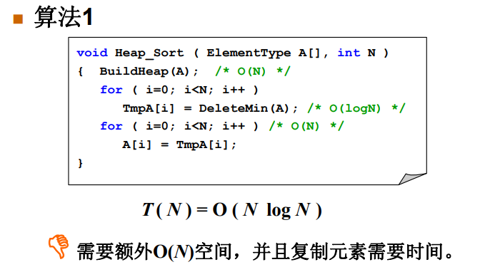

# 关于排序的补充


<!-- @import "[TOC]" {cmd="toc" depthFrom=3 depthTo=6 orderedList=false} -->

<!-- code_chunk_output -->

- [本节只讨论内排序](#本节只讨论内排序)
- [稳定性](#稳定性)
- [排序方法简记](#排序方法简记)
  - [冒泡排序](#冒泡排序)
  - [插入排序](#插入排序)
  - [希尔排序](#希尔排序)
  - [选择排序](#选择排序)
  - [堆排序](#堆排序)
  - [归并排序](#归并排序)
  - [快速排序](#快速排序)
- [排序方法升级逻辑](#排序方法升级逻辑)

<!-- /code_chunk_output -->

本笔记动图来自[https://www.runoob.com/w3cnote/ten-sorting-algorithm.html](https://www.runoob.com/w3cnote/ten-sorting-algorithm.html)。

### 本节只讨论内排序

- 内排序：指在排序期间数据对象全部存放在内存的排序。
- 外排序：指在排序期间全部对象太多，不能同时存放在内存中，必须根据排序过程的要求，不断在内，外存间移动的排序。

### 稳定性

稳定性：任意两个相等的数据，排序前后的相对位置不发生改变。

### 排序方法简记

#### 冒泡排序


```c
void Bubble_Sort(ElementType A[], int N)
{
    for (int P = N - 1; P >= 0; P --)
    {
        flag = 0;
        for (int i = 0; i < P; ++ i)
        {
            if (A[i], A[i + 1])
            {
                Swap(A[i], A[i + 1]);
                flag = 1;
            }
        }
        if (flag == 0) break;
    }
}
```

最坏： $O(N^2)$ ，最好 $O(N)$ 。

是稳定的。

#### 插入排序


```c
void Insertion_Sort(ElementType A[], int N)
{
    for (int P = 1; P < N; ++ P)
    {
        Tmp = A[P];
        int i;
        for (i = P; i > 0 && A[i - 1] > Tmp; -- i)
            A[i] = A[i - 1];
        A[i] = Tmp;
    }
}
```

最坏： $O(N^2)$ ，最好 $O(N)$ 。

是稳定的。

#### 希尔排序


```c
void ShellSort(ElementType A[], int N)
{ /* 希尔排序 - 用Sedgewick增量序列 */
    int Si, D, P, i;
    ElementType Tmp;
    /* 这里只列出一小部分增量 */
    int Sedgewick[] = {929, 505, 209, 109, 41, 19, 5, 1, 0};

    for (Si = 0; Sedgewick[Si] >= N; Si++)
        ; /* 初始的增量Sedgewick[Si]不能超过待排序列长度 */

    for (D = Sedgewick[Si]; D > 0; D = Sedgewick[++Si])
        for (P = D; P < N; P++)
        { /* 插入排序*/
            Tmp = A[P];
            for (i = P; i >= D && A[i - D] > Tmp; i -= D)
                A[i] = A[i - D];
            A[i] = Tmp;
        }
}
```

为什么用 `Sedgewick` 增量？
- 增量元素不互质，则小增量可能根本不起作用

最坏情况也是 $O(n^2)$ 。

不稳定。因为其虽然是插排的升级，但是不是把相邻的逆序对消除。

#### 选择排序


```c
void swap(int *a,int *b)
{
    int temp = *a;
    *a = *b;
    *b = temp;
}
void selection_sort(int arr[], int len)
{
    int i,j;

    for (i = 0 ; i < len - 1 ; i++)
    {
        int min = i;
        for (j = i + 1; j < len; j++)
            if (arr[j] < arr[min])
                min = j;
        swap(&arr[min], &arr[i]);
    }
}
```

很直观，找最小的，换位置， $O(n^2)$ 的。

不稳定。

#### 堆排序



如上，很直观的做法是开一个最小堆，然后取堆顶。这不智慧：利用了额外空间，并且复制元素。


如上，智慧的做法是：
- 先利用原数组建一个 **最大堆** ，`PercDown(数组, 根节点位置, 最后一个结点位置+1)`
- 然后将最后一个结点放在数组最后，之后将`堆规模-1`向下过滤，这样保证了在最后的元素总是数组中最大的


看动图，也都是这个思路：**所有元素建最大堆，之后把堆顶放在最后，然后调整，然后缩小一下堆规模。**

$O(nlog_2{n})$ ，且是不稳定的。

#### 归并排序


$O(nlog_2{n})$ ，且递归和非递归的方法都是稳定的。

一般用在外排序，不用在内排序。

#### 快速排序


$O(nlog_2{n})$ ，且不稳定。

这里的基准找到的是最左边元素， y 总讲的是找中间的元素。无所谓，找个基准就行。

### 排序方法升级逻辑

冒泡和插排都是每进行一次操作/检查**都仅仅交换相邻的元素。** 这导致：**只能消除一个逆序对。**

这就低效了。

因此提出希尔排序。

希尔排序的基本思想是：先将整个待排序的记录序列分割成为若干子序列分别进行直接插入排序，待整个序列中的记录"基本有序"时，再对全体记录进行依次直接插入排序。

希尔排序相当于插排的改进：
- 插入排序在对几乎已经排好序的数据操作时，效率高，即可以达到线性排序的效率；
- 但插入排序一般来说是低效的，因为插入排序每次只能将数据移动一位。（希尔排序针对这点进行改进）

但是希尔排序最坏情况也是 $O(n^2)$ 。

能不能 $O(nlog_2{n})$ 呢？

来看看 $O(n^2)$ 的选择排序，其中每次 `for` 中都要再花费 $O(n)$ 来找最小元素。如果我们可以把找最小元素优化成 $O(log_2{n})$ ，那就是堆排序。

此外还有归并排序。归并排序和快排 y 总讲了，我就不详细记录了。
