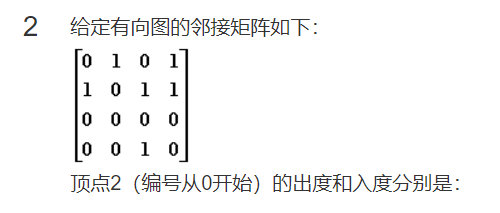
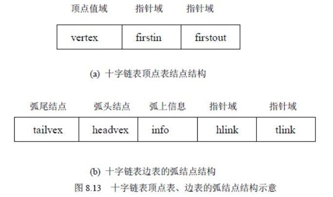
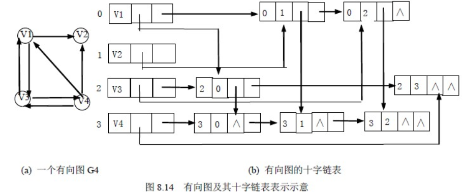

<!-- @import "[TOC]" {cmd="toc" depthFrom=1 depthTo=6 orderedList=false} -->

<!-- code_chunk_output -->

- [选择题](#选择题)
  - [有个顶点的无向完全图有多少条边](#有个顶点的无向完全图有多少条边)
  - [给定有向图的邻接矩阵如下求出度入度](#给定有向图的邻接矩阵如下求出度入度)
  - [有向图的邻接矩阵一定是不对称的（不对）](#有向图的邻接矩阵一定是不对称的不对)
  - [用一维数组G存储有4个顶点的无向图如下](#用一维数组g存储有4个顶点的无向图如下)
  - [用邻接表表示图，则遍历图中所有边的时间复杂度](#用邻接表表示图则遍历图中所有边的时间复杂度)
- [讨论题](#讨论题)
  - [关于用链表得到有向图的出、入度--其他办法](#关于用链表得到有向图的出-入度-其他办法)
- [编程题](#编程题)
  - [](#)

<!-- /code_chunk_output -->


## 选择题

### 有个顶点的无向完全图有多少条边

有个顶点的无向完全图有多少条边？

$$N(N-1)/2$$

想象邻接矩阵的下三角元素个数（不算对角线）：
$1 + 2 + ... + (N-1)$

### 给定有向图的邻接矩阵如下求出度入度



> 0, 2

### 有向图的邻接矩阵一定是不对称的（不对）

有向图的邻接矩阵一定是不对称的，肯定不对。

### 用一维数组G存储有4个顶点的无向图如下

用一维数组`G[ ]`存储有`4`个顶点的无向图如下：

`G[ ] = { 0, 1, 0, 1, 1, 0, 0, 0, 1, 0 }`

则顶点2和顶点0之间是有边的。

> 对，参考<a href="../resources/6.1 什么是图.pdf">resources/6.1 什么是图.pdf</a>第11页。

```
0
1 0
1 1 0
0 0 1 0
```

### 用邻接表表示图，则遍历图中所有边的时间复杂度

用邻接表表示有个 N 顶点、 E 条边的图，则遍历图中所有边的时间复杂度为：

> O(N + E)

想象最坏情况：所有边都存在于一个点上，则我们需要遍历所有点，这为 $N$ ，然后其中一个点对应的链表长度为 $E$ 。

## 讨论题

### 关于用链表得到有向图的出、入度--其他办法

出度好求，入度建一个逆邻接表就好。

参考[图的存储表示—十字链表](http://c.biancheng.net/cpp/html/993.html)。



如上，十字链表（Orthogonal List）是有向图的一种存储方法，它实际上是邻接表与逆邻接表的结合，即把每一条边的边结点分别组织到以弧尾顶点为头结点的链表和以弧头顶点为头顶点的链表中：
- 其中尾域(`tailvex`)和头(`headvex`)分别指示弧尾和弧头这两个顶点在图中的位置
- 链域 `hlink` 指向弧头相同的下一条弧，链域 `tlink` 指向弧尾相同的下一条弧
- `info` 域指向该弧的相关信息。弧头相同的弧在同一链表上，弧尾相同的弧也在同一链表上。
- 它们的头结点即为顶点结点，它由三个域组成：其中 `vertex` 域存储和顶点相关的信息，如顶点的名称等； `firstin` 和 `firstout` 为两个链域，分别指向以该顶点为弧头或弧尾的第一个弧结点。

```c
#define MAX_VERTEX_NUM 20

typedef struct _ArcBox {
    int tailvex, headvex; /* 该弧的尾和头顶点的位置 */
    struct _ArcBox *hlink, *tlink; /* 分别为弧头相同和弧尾相财的弧的链域 */
    InfoType info; /* 该弧相关信息的指针 */
}ArcBox;

typedef struct _VexNode {
    VertexType vertex:
    ArcBox *fisrin, *firstout; /* 分别指向该顶点第一条入弧和出弧 */
}VexNode;

typedef struct _OLGraph{
    VexNode xlist[MAX_VERTEX_NUM]; /*表头向量*/
    int vexnum, arcnum; /*有向图的顶点数和弧数*/
}OLGraph;
```



示例如上。

## 编程题

### 
