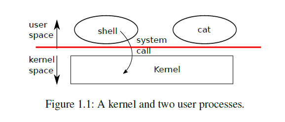

# LEC 1 (rtm): Introduction and examples

目录：

<!-- @import "[TOC]" {cmd="toc" depthFrom=2 depthTo=2 orderedList=false} -->

<!-- code_chunk_output -->

- [课前预习：阅读教材第一章](#课前预习阅读教材第一章)
- [作业](#作业)

<!-- /code_chunk_output -->

细分目录：

<!-- @import "[TOC]" {cmd="toc" depthFrom=2 depthTo=6 orderedList=false} -->

<!-- code_chunk_output -->

- [课前预习：阅读教材第一章](#课前预习阅读教材第一章)
  - [Foreword and acknowledgments](#foreword-and-acknowledgments)
  - [Chapter 1 Operating system interfaces](#chapter-1-operating-system-interfaces)
    - [1.1 Processes and memory](#11-processes-and-memory)
      - [system call: fork](#system-call-fork)
      - [system call: exec](#system-call-exec)
      - [main structure of shell](#main-structure-of-shell)
- [作业](#作业)

<!-- /code_chunk_output -->

## 课前预习：阅读教材第一章

教材：[../lec/book-riscv-rev1.pdf](../lec/book-riscv-rev1.pdf)

### Foreword and acknowledgments

xv6 基于 Unix 之父的 Unix Version 6 （最经典的操作系统），并且，是基于 `ANSI C for a multi-core RISC-V` 实现的。

### Chapter 1 Operating system interfaces

什么是操作系统？

The job of an operating system is to share a computer among multiple programs and to provide a more useful set of services than the hardware alone supports. An operating system manages and abstracts the low-level hardware, so that, for example, a word processor need not concern itself with which type of disk hardware is being used. An operating system shares the hardware among multiple programs so that they run (or appear to run) at the same time. Finally, operating systems provide controlled ways for programs to interact, so that they can share data or work together.

我概括一下：
- 封装硬件，给应用程序提供运行环境
- 调配应用程序间资源

接着这里阐明了为什么用 xv6 系统。系统精简巧妙，其基于的 Unix v6 是最经典的操作系统，是现代操作系统的鼻祖：
- 接口单一，但是泛化性很强（功能强）
- 设计思维影响了几乎所有现代操作系统



如上，按我的理解， `cat` 应该也和 `shell` 一样，也是一个 `process` 。上图中， `shell` 发起了一个系统调用 `system call` 。


Xv6 实现了 Unix v6 的系统调用的子集。

#### 1.1 Processes and memory

进程 process 由以下部分组成：
- 用户态内存 user-space memory ： instructions, data, stack
- 在内核状态 per-process state private to the kernel

Xv6 管理进程：在后台给进程切换可用 CPU ，进程挂起（保存 its CPU registers, restoring them when it next runs the process），分配 PID 等。

##### system call: fork

一个进程创建新的 process ，可以用系统调用 `fork` 。

`fork` 父子进程的内存相同，父进程返回子进程 PID ，子进程返回 0 。

```c
int pid = fork();
if (pid > 0) {
    printf("parent: child=%d\n", pid);
    pid = wait((int *) 0);
    printf("child %d is done\n", pid);
} else if (pid == 0) {
    printf("child: exiting\n");
    exit(0);
} else {
    printf("fork error\n");
}
```

如上程序，可能输出：
```
parent: child=1234
child: exiting
parent: child 1234 is done
```

解释一下重点：
- `wait` 返回当前进程子进程的 `PID` ，并且传入一个指针，这个指针将被修改为指向 `child exit status`
- 所以，如果我们不在乎 `child exit status` 可以传入一个无所谓的 0 指针（`(int *) 0`）
- 初始化时，父子进程的 `memory` 与 `registers` 相同，但之后改变其中一个的变量并不影响另一个的变量

##### system call: exec

`exec` 系统调用会把 calling process 的内存用新内存快照替换掉，这个内存快照会遵守特定的格式：
- ELF 格式（第三章将会详细讨论）
- 包括数据区、指令从哪里开始

`exec` 成功执行后，并不返回调用它的程序（ calling process ），而是到 ELF header 那里。

`exec` 有两个参数：
- 可执行文件名
- 参数（`an array of string`）

```c
char *argv[3];

argv[0] = "echo";
argv[1] = "hello";
argv[2] = 0;
exec("/bin/echo", argv);
printf("exec error\n");
```

我们的程序在、是 `/bin/echo` 文件；大部分程序会无视参数数组的第一个，因为那个往往是程序名称。

##### main structure of shell

`shell` 的 `main` 是一个 `loop` ，用 `getcmd` 读输入，然后调用 `fork` （ `creates a copy of the shell process` ）。

参考：[https://github.com/mit-pdos/xv6-riscv/blob/riscv//user/sh.c#L145](https://github.com/mit-pdos/xv6-riscv/blob/riscv//user/sh.c#L145)

```c
main(void)
{
  static char buf[100];
  int fd;

  // Ensure that three file descriptors are open.
  while((fd = open("console", O_RDWR)) >= 0){
    if(fd >= 3){
      close(fd);
      break;
    }
  }

  // Read and run input commands.
  while(getcmd(buf, sizeof(buf)) >= 0){
    if(buf[0] == 'c' && buf[1] == 'd' && buf[2] == ' '){
      // Chdir must be called by the parent, not the child.
      buf[strlen(buf)-1] = 0;  // chop \n
      if(chdir(buf+3) < 0)
        fprintf(2, "cannot cd %s\n", buf+3);
      continue;
    }
    if(fork1() == 0)
      runcmd(parsecmd(buf));
    wait(0);
  }
  exit(0);
}
```

原来 `cd` 指令不是个进程，牛逼。

## 作业
