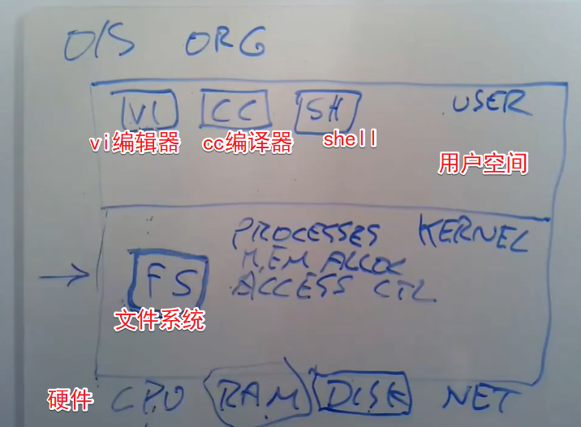

# LEC 1 (rtm): Introduction and examples

笔记大量参考了[肖宏辉](https://www.zhihu.com/people/xiao-hong-hui-15)大佬的翻译：
- https://www.zhihu.com/column/c_1294282919087964160

目录：

<!-- @import "[TOC]" {cmd="toc" depthFrom=2 depthTo=2 orderedList=false} -->

<!-- code_chunk_output -->

- [课程简介：操作系统做哪些事](#课程简介操作系统做哪些事)
- [计算机系统](#计算机系统)

<!-- /code_chunk_output -->

细分目录：

<!-- @import "[TOC]" {cmd="toc" depthFrom=2 depthTo=6 orderedList=false} -->

<!-- code_chunk_output -->

- [课程简介：操作系统做哪些事](#课程简介操作系统做哪些事)
- [计算机系统](#计算机系统)
  - [Kernel在干什么](#kernel在干什么)
  - [系统调用以及例子](#系统调用以及例子)
  - [为什么操作系统的设计是困难且有趣的？](#为什么操作系统的设计是困难且有趣的)

<!-- /code_chunk_output -->

## 课程简介：操作系统做哪些事

对于操作系统的目标，我也列出了几个点。你知道的，市面上有大量不同的操作系统，通常来说，他们都有一些共同的目标。
- 第一个就是抽象硬件。通常来说，你会买一个计算机，里面包含了CPU，内存，但是这是一种非常低层级的资源。幸好我们有一些应用程序实现了高层级的接口和抽象，例如进程，文件系统。这些高层级的接口和抽象（`Abstraction`）方便了应用的开发，也提供了更好的移植性。
- 操作系统的另一个重要的任务是：在多个应用程序之间共用硬件资源。你可以在一个操作系统同时运行文本编辑器，程序编译器，多个数据库等等。操作系统能非常神奇的在不相互干扰的前提下，同时运行这些程序。这里通常被称为`multiplex`。
- 因为在操作系统中可能同时运行很多程序，即使程序出现了故障，多个程序之间互不干扰就变得非常重要。所以这里需要隔离性（`Isolation`），不同的活动之间不能相互干扰。
- 但是另一方便，不同的活动之间有时又想要相互影响，比如说数据交互，协同完成任务等。举个例子，我通过文本编辑器创建了一个文件，并且我希望我的编译器能读取文件，我绝对想要数据能共享。所以，我们希望能在需要的时候实现共享（`Sharing`）。
- 但是在很多场景下，用户并不想要共享，比如你登录到了一个公共的计算机，例如`Athena`，你不会想要其他人来读取你的文件。所以在共享的同时，我们也希望在没有必要的时候不共享。这里我们称为`Security`或者`Permission System`或者是`Access Control System`。
- 另一个人们认为操作系统应该具有的价值是：如果你在硬件上花费了大量的金钱，你会期望你的应用程序拥有硬件应该提供的完整性能，但是很多时候你只负责应用程序编程，你会期望操作系统也必须保证自身提供的服务不会阻止应用程序获得高性能。所以操作系统需要至少不阻止应用程序获得高性能，甚至需要帮助应用程序获得高性能（`Performance`）。
- 最后，对于大部分操作系统，必须要支持大量不同类型的应用程序，或许这是一个笔记本，正在运行文本编辑器，正在运行游戏，或许你的操作系统需要支持数据库服务器和云计算。通常来说，设计并构造一个操作系统代价是非常大的，所以人们总是希望在相同的操作系统上，例如`Linux`，运行大量的任务。我认为大部分人都已经跑过`Linux`，并使用了我刚刚描述的所有的场景。所以，同一个操作系统需要能够支持大量不同的用户场景。

## 计算机系统

### Kernel在干什么



区别于用户空间程序，有一个特殊的程序总是会在运行，它称为`Kernel`。`Kernel`是计算机资源的守护者。当你打开计算机时，`Kernel`总是第一个被启动。`Kernel`程序只有一个，它维护数据来管理每一个用户空间进程。`Kernel`同时还维护了大量的数据结构来帮助它管理各种各样的硬件资源，以供用户空间的程序使用。`Kernel`同时还有大量内置的服务，例如，`Kernel`通常会有文件系统实现类似文件名，文件内容，目录的东西，并理解如何将文件存储在磁盘中。所以用户空间的程序会与`Kernel`中的文件系统交互，文件系统再与磁盘交互。

在这门课程中，我们主要关注点在`Kernel`、连接`Kernal`和用户空间程序的接口、`Kernel`内软件的架构。所以，我们会关心`Kernel`中的服务，其中一个服务是文件系统，另一个就是进程管理系统。每一个用户空间程序都被称为一个进程，它们有自己的内存和共享的CPU时间。同时，`Kernel`会管理内存的分配。不同的进程需要不同数量的内存，`Kernel`会复用内存、划分内存，并为所有的进程分配内存。

文件系统通常有一些逻辑分区。目前而言，我们可以认为文件系统的作用是管理文件内容并找出文件具体在磁盘中的哪个位置。文件系统还维护了一个独立的命名空间，其中每个文件都有文件名，并且命名空间中有一个层级的目录，每个目录包含了一些文件。所有这些都被文件系统所管理。

这里还有一些安全的考虑，我们可以称之为`Access Control`。当一个进程想要使用某些资源时，比如读取磁盘中的数据，使用某些内存，`Kernel`中的`Access Control`机制会决定是否允许这样的操作。对于一个分时共享的计算机，例如`Athena`系统，这里可能会变得很复杂。因为在`Athena`系统中，每一个进程可能属于不同的用户，因此会有不同`Access`规则来约定哪些资源可以被访问。

在一个真实的完备的操作系统中，会有很多很多其他的服务，比如在不同进程之间通信的进程间通信服务，比如一大票与网络关联的软件（`TCP/IP`协议栈），比如支持声卡的软件，比如支持数百种不同磁盘，不同网卡的驱动。所以在一个完备的系统中，`Kernel`会包含大量的内容，数百万行代码。

### 系统调用以及例子

我们同时也对应用程序是如何与`Kernel`交互，它们之间的接口长什么样感兴趣。这里通常成为`Kernel`的`API`，它决定了应用程序如何访问`Kernel`。通常来说，这里是通过所谓的系统调用（`System Call`）来完成。

```c
fd = open("out", 1);
write(fd, "hello\n", 6);
pid = fork();
```

第一个例子是，如果应用程序需要打开一个文件，它会调用名为`open`的系统调用，并且把文件名作为参数传给`open`。假设现在要打开一个名为“`out`”的文件，那么会将文件名“`out`”作为参数传入。同时我们还希望写入数据，那么还会有一个额外的参数，在这里这个参数的值是`1`，表明我想要写文件。

这里看起来像是个函数调用，但是`open`是一个系统调用，它会跳到`Kernel`，`Kernel`可以获取到`open`的参数，执行一些实现了`open`的`Kernel`代码，或许会与磁盘有一些交互，最后返回一个文件描述符对象。上图中的`fd`全称就是`file descriptor`。之后，应用程序可以使用这个文件描述符作为`handle`，来表示相应打开的文件。

如果你想要向文件写入数据，相应的系统调用是`write`。你需要向`write`传递一个由`open`返回的文件描述符作为参数。你还需要向`write`传递一个指向要写入数据的指针（数据通常是`char`型序列），在C语言中，可以简单传递一个双引号表示的字符串（`\n`表示是换行）。第三个参数是你想要写入字符的数量。

第二个参数的指针，实际上是内存中的地址。所以这里实际上告诉内核，将内存中这个地址起始的`6`个字节数据写入到`fd`对应的文件中。

另一个你可能会用到的，更有意思的系统调用是`fork`。`fork`是一个这样的系统调用，它创建了一个与调用进程一模一样的新的进程，并返回新进程的`process ID/pid`。这里实际上会复杂的多，我们后面会有更多的介绍。

> 学生提问：系统调用跳到内核与标准的函数调用跳到另一个函数相比，区别是什么？

> `Robert`教授：`Kernel`的代码总是有特殊的权限。当机器启动`Kernel`时，`Kernel`会有特殊的权限能直接访问各种各样的硬件，例如磁盘。而普通的用户程序是没有办法直接访问这些硬件的。所以，当你执行一个普通的函数调用时，你所调用的函数并没有对于硬件的特殊权限。然而，如果你触发系统调用到内核中，内核中的具体实现会具有这些特殊的权限，这样就能修改敏感的和被保护的硬件资源，比如访问硬件磁盘。我们之后会介绍更多有关的细节。

### 为什么操作系统的设计是困难且有趣的？

- 高效又易用：高效通常意味着操作系统需要在离硬件近的low-level进行操作，而易用则要求操作系统为应用程序提供抽象的high-level可移植接口
- 强大的操作系统服务：我们不想程序员看到数量巨多，复杂且难以理解的的内核接口。因为，如果他们不理解这些接口，他们就会很难使用这些接口。所以，我们也想要简单的API。所以，这里要提供一个简单的接口，同时又包含了强大的功能。
- 自由又安全：你希望给与应用程序尽可能多的灵活性，你不会想要限制应用程序，所以你需要内核具备灵活的接口。但是另一方面，你的确需要在某种程度上限制应用程序，因为你会想要安全性。我们希望给程序员完全的自由，但是实际上又不能是真正的完全自由，因为我们不想要程序员能直接访问到硬件，干扰到其他的应用程序，或者干扰操作系统的行为。

- 问：对于应用程序开发人员来说，他们会基于一些操作系统做开发，真正的深入理解这些操作系统有多重要？他们需要成为操作系统的专家吗？
  - 答：你不必成为一个专家。但是如果你花费大量时间来开发，维护并调试应用程序，你最终还是会知道大量操作系统的知识。不论你是否是有意要掌握这些知识，它们就是出现了，而你不得不去理解它们。
- 问：对于一些例如Python的高阶编程语言（高阶是指离自然语言更接近，低阶是指离机器语言更接近如C，汇编），它们是直接执行系统调用呢，还是内部对系统调用进行了封装呢？
  - 许多高阶的编程语言都离系统调用较远，这是一个事实。部分原因是很多编程语言想要提供可以在多个操作系统上运行的可移植的环境，所以它们不能依赖特定的系统调用。所以，对于这个问题的答案我认为是，如果你使用了Python，你在某种程度上就与系统调用接口隔离了。当然，在Python内部，最终还是要执行系统调用来完成相应的工作。当然，Python和许多其他的编程语言通常都有方法能直接访问系统调用。
